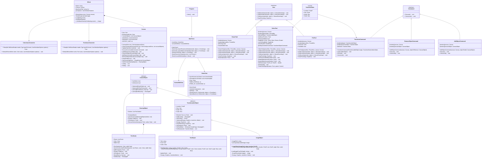

```mermaid
classDiagram
    class Program{
        + Main(): void
    }

    class MainForm{
        - homeView: HomeView
        - canvasEditView: CanvasEditView
        + MainForm()
        - HomeView_OpenPictureListClicked(sender: object, e: EventArgs): void
        - HomeView_OpenAlbumListClicked(sender; object, e: EventArgs): void
        - ShowHomeView(s: object, e: EventArgs): void
        - ShowPictureListView(pictureList: List~Picture~)
        - ShowCanvasEditView(album: Album): void
    }

    class HomeView{
        + OpenPictureListClicked: event EventHandler
        + OpenAlbumListClicked: event EventHandler
        - Timer: Timer
        - TIMER_INTERVAL: int
        - SPEED_OF_SLIDESHOW: int
        + HomeView()
        + InitializeComponent(): void
        + Update(): void
        + OpenPicturList_Click(sender: object, e: EventArgs):
        + OpenAlbumList_Click(sender: object, e: EventArgs):
    }

    class Album{
        + Name: string
        + Canvas: Canvas
        - _BaseSavePath_: string<\u>
        - _jsonOptions_: JsonSerializerOptions
        + Album(string name, Canvas canvas)
        + Save(Image previewImage)
        + _Load_(string name)
        + _GetAlbumNames_()
        + _GetAlbumDirectoryPath(string name)_: Image
    }

    class FontJasonConverter{
        + Read(ref Utf8JsonReader reader, Type typeToConvert, JsonSerializerOptions options): Font
        + Write(Utf8JsonWriter writer, Font value, JsonSerializerOptions options): void
    }

    class ColorJasonConverter{
        + Read(ref Utf8JsonReader reader, Type typeToConvert, JsonSerializerOptions options): Color
        + Write(Utf8JsonWriter writer, Color value, JsonSerializerOptions options): void
    }
    
    class Canvas{
        + Size: Size
        + BackgroundColor: Color
        + CanvasObjects: List~CanvasObject~
        - undoHistory: List~ICommand~
        - redoHistory: List~ICommand~
        - HISTORY_LIMIT: int
        + Canvas(Size size, Color backgroundColor)
        + [JsonConstructor]Canvas(Size size, Color backgroundColor, List<CanvasObject> canvasObjects)
        + UpdateSize(Size newSize): void
        + ExecuteCommand(ICommand command): void
        + AddObject(CanvasObject obj): void
        + RemoveObject(CanvasObject obj): void
        - AddObjectInternal(CanvasObject obj): void
        - RemoveObjectInternal(CanvasObject obj): void
        + Draw(Graphics g): void
        + GetCanvasObjects(): IReadOnlyList~CanvasObject~
        + GetOrCreatedrawingObject(): DrawingObject
        + Undo(): void
        + Redo(): void
    }

    class CanvasObject{
        <<abstract>>
        + CanSelect: bool
        + IsSelected: bool
        + *[abstract]Draw(Grahics g): void*
        + *[abstract]HitTest(Point point): bool*
        + *[virtual]Move(float dx, float dy): void*
        + *[virtual]GetBounds(): RectangleF*
    }

    class DrawingObject{
        + Strokes: List~PenStroke~
        + DrawingObject()
        + [JsonConstructor]DrawingObject(strokes: List<PenStroke>)
        + Draw(g: Graphics): void
        + HitTest(point: Point): bool
        + RemoveStrokesNear(point: Point, radius: float): void
    }

    class PenStroke{
        + Points: List~Point~
        + Color: Color
        + Width: float
        + PenStroke(color: Color, width: float)
        + [JsonConstructor]PenStroke(points: List~Point~, color: Color, width: float)
        + AddPoint(point: Point): void
        + Draw(g: Graphics): void
        + HitTest(point: Point): bool
        + Move(float dx, float dy): void
        + GetBounds(): RectangleF
    }

    class TransformableObject{
        <<abstruct>>
        + Location: PointF
        + Size: Size
        + Angle: float
        + Scale: float
        + Move(dx: float, dy: float): void
        + GetBounds(): RectangleF
        + GetCenter(): PointF
        + *[abstract]Draw(g: Graphics, transform: Matrix): void*
        + Draw(g: Graphics): void
        + DrawSelection(g: Graphics): void
        + HisTest(point: Point): bool
        + GetHandles(): Dictionary~HandleType, RectangleF~
        + SetStaste(state: TransfromState): void
    }

    class ImageObject{
        + ImagePath: string
        + [JsonIgnore]LoadedImage: Image
        + ImageObject(imagePath: string, location: PointF)
        + [JsonConstructor]ImageObject(imagePath: string, location: PointF, size: SizeF, angle: float, scale: float)
        +LoadImageFromPath(path: string): void
        - CreatePlaceholderImage(): Image
        + Draw(g: Graphics, transform: Matrix): void
    }

    class TextObject{
        + Text: string
        + Font: Font
        + Color: Color
        + TextObject(text: string, location: PointF, color: Color)
        + [JsonConstructor]TextObject(text: string, location: PointF, color: Color, location: PointF, size: SizeF, angle: float, scale: float)
        - UpdateSize(): void
        + Draw(g: Graphics, transformMatrix): void
    }

    class ITool{
        <<Interface>>
        + *OnMouseDown(sender: object, e: MouseEventArgs): void*
        + *OnMouseMove(sender: object, e: MouseEventArgs): void*
        + *OnMouseUp(sender: object, e: MouseEventArgs): void*
        + *DrawPreview(g: Graphics):*
    }

    class PenTool{
        - [readonly]canvas: Canvas
        - [readonly]pictureBox: PictureBox
        + PenColor: Color
        + PenWidth: float
        + PenTool(pictureBox: PictureBox, canvas: Canvas)
        + OnMouseDown(sender: object, e: MouseEventArgs): void
        + OnMouseMove(sender: object, e: MouseEventArgs): void
        + OnMouseUp(sender: object, e: MouseEventArgs): void
        + DrawPreview(g: Graphics): void
    }

    class EraserTool{
        - [readonly]canvas: Canvas
        - [readonly]pictureBox: PictureBox
        - isErasing: bool
        + EraserWidth: float
        + EraserTool(pictureBox: PictureBox, canvas: Canvas)
        + OnMouseDown(sender: object, e: MouseEventArgs): void
        + OnMouseMove(sender: object, e: MouseEventArgs): void
        + OnMouseUp(sender: object, e: MouseEventArgs): void
        + DrawPreview(g: Graphics): void
        - EraseAt(location: Point): void
    }

    class SelectTool{
        - [readonly]canvas: Canvas
        - [readonly]pictureBox: PictureBox
        - selectedObject: TransformableObject
        - lastMousePosition: Point
        - isTextInsertMode: bool
        - DragMode: enum ~None, Move, Resize, Rotate~
        - currentDragMode: DragMode
        - activeHandle: HandleType
        - pendingTransformCommand: TransformObjectCommand
        + SelectTool(pictureBox: PictureBox, canvas: Canvas)
        + OnMouseDown(sender: object, e: MouseEventArgs): void
        + OnMouseMove(sender: object, e: MouseEventArgs): void
        + OnMouseUp(sender: object, e: MouseEventArgs): void
        + DrawPreview(g: Graphics): void
        + SetTextInsertMode(enabled: bool): void
        - RotateObject(mousePosition: Point): void
        - ResizeObject(mousePosition: Point): void
        - GetDistance(p1: PointF, p2: PointF): double
        - DeselectAll(): void
        - CreateTextObject(location: Point, parent: Control)
    }

    class ICommand{
        <<Interface>>
        + *Execute(): void*
        + *Unexecute(): void*
    }

    class AddObjectCommand{
        - [readonly]canvas: Canvas
        - [readonly]canvasObject: CanvasObject
        + AddObjectCommand(canvas: Canvas, objectToAdd: CanvasObject)
        + Execute(): void
        + Unexecute(): void
    }

    class RemoveObjectCommand{
        - [readonly]canvas: Canvas
        - [readonly]canvasObject: CanvasObject
        + AddObjectCommand(canvas: Canvas, objectToRemove: CanvasObject)
        + Execute(): void
        + Unexecute(): void
    }

    class TransformCommand{
        - [readonly]target: TransformableObject
        - [readonly]canvasObject: TransformState
        - afterState: TransformState
        + TransformCommand(TransfromableObject target, TransformState beforeState)
        + CaptureAfterState(): void
        + Execute(): void
        + Unexecute(): void
    }

    class TransformState{
        <<record>>
        + Location: PointF
        + Size: SizeF
        + Angle: float
        + Scale: float
    }


    Program --> MainForm
    MainForm --> HomeView
    MainForm --> CanvasEditView


    Album *-- Canvas

    Album --> FontJasonConverter
    Album --> ColorJasonConverter

    Canvas *-- CanvasObject
    CanvasObject <|-- TransformableObject
    CanvasObject <|-- DrawingObject
    CanvasObject <|-- PenStroke

    DrawingObject *-- PenStroke

    TransformableObject <|-- ImageObject
    TransformableObject <|-- TextObject


    ITool <|-- PenTool
    ITool <|-- EraserTool
    ITool <|-- SelectTool

    ICommand <|-- AddObjectCommand
    ICommand <|-- RemoveObjectCommand
    ICommand <|-- TransformCommand

    TransformState --> TransformCommand
    TransformState --> SelectTool
    
```
