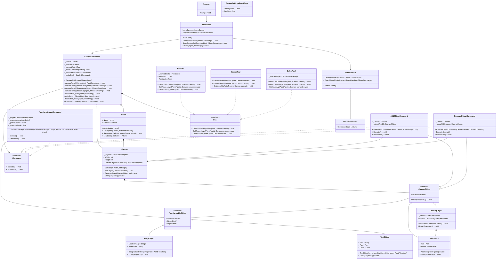

```mermaid
classDiagram
    class Program {
        +  Main() : void
    }

    class MainForm {
        - homeScreen : HomeScreen
        - canvasEditScreen : CanvasEditScreen
        + MainForm()
        - ShowHomeScreen(object, EventArgs) : void
        - ShowCanvasEditScreen(object, AlbumEventArgs) : void
        - OnExit(object, EventArgs) : void
    }

    %% --- Views ---
    class HomeScreen {
        + CreateNewAlbumClicked : event EventHandler
        + OpenAlbumClicked : event EventHandler~AlbumEventArgs~
        + HomeScreen()
    }

    class CanvasEditScreen {
        - _album : Album
        - _canvas : Canvas
        - _currentTool : ITool
        - _tools : Dictionary~string, ITool~
        - _undoStack : Stack~ICommand~
        - _redoStack : Stack~ICommand~
        + CanvasEditScreen(Album album)
        - canvasPanel_Paint(object, PaintEventArgs) : void
        - canvasPanel_MouseDown(object, MouseEventArgs) : void
        - canvasPanel_MouseMove(object, MouseEventArgs) : void
        - canvasPanel_MouseUp(object, MouseEventArgs) : void
        - undoButton_Click(object, EventArgs) : void
        - redoButton_Click(object, EventArgs) : void
        - toolButton_Click(object, EventArgs) : void
        - ExecuteCommand(ICommand command) : void
    }

    %% --- Models ---
    class Album {
        + Name : string
        + Canvas : Canvas
        + Album(string name)
        + Album(string name, Size canvasSize)
        + Save(string filePath, ImageFormat format) : void
        + Load(string filePath) : Album
    }

    class Canvas {
        - _objects : List~CanvasObject~
        + Width : int
        + Height : int
        + CanvasObjects : IReadOnlyList~CanvasObject~
        + Canvas(int width, int height)
        + AddObject(CanvasObject obj) : int
        + RemoveObject(CanvasObject obj) : void
        + Draw(Graphics g) : void
    }

    %% --- Commands ---
    class ICommand {
        <<interface>>
        + Execute() : void
        + Unexecute() : void
    }
    class AddObjectCommand {
        - _canvas : Canvas
        - _objectToAdd : CanvasObject
        + AddObjectCommand(Canvas canvas, CanvasObject obj)
        + Execute() : void
        + Unexecute() : void
    }
    class RemoveObjectCommand {
        - _canvas : Canvas
        - _objectToRemove : CanvasObject
        + RemoveObjectCommand(Canvas canvas, CanvasObject obj)
        + Execute() : void
        + Unexecute() : void
    }
    class TransformObjectCommand {
        - _target : TransformableObject
        - _previousLocation : PointF
        - _previousSize : SizeF
        - _previousAngle : float
        + TransformObjectCommand(TransformableObject target, PointF loc, SizeF size, float angle)
        + Execute() : void
        + Unexecute() : void
    }

    %% --- Tools ---
    class ITool {
        <<interface>>
        + OnMouseDown(PointF point, Canvas canvas) : void
        + OnMouseMove(PointF point, Canvas canvas) : void
        + OnMouseUp(PointF point, Canvas canvas) : void
    }
    class PenTool {
        - _currentStroke : PenStroke
        + PenColor : Color
        + PenWidth : float
        + OnMouseDown(PointF point, Canvas canvas) : void
        + OnMouseMove(PointF point, Canvas canvas) : void
        + OnMouseUp(PointF point, Canvas canvas) : void
    }
    class EraserTool {
        + OnMouseDown(PointF point, Canvas canvas) : void
        + OnMouseMove(PointF point, Canvas canvas) : void
        + OnMouseUp(PointF point, Canvas canvas) : void
    }
    class SelectTool {
        - _selectedObject : TransformableObject
        + OnMouseDown(PointF point, Canvas canvas) : void
        + OnMouseMove(PointF point, Canvas canvas) : void
        + OnMouseUp(PointF point, Canvas canvas) : void
    }

    %% --- CanvasObjects ---
    class CanvasObject {
        <<abstract>>
        + IsSelected : bool
        # Draw(Graphics g) : void
    }
    class TransformableObject {
        <<abstract>>
        + Location : PointF
        + Size : SizeF
        + Angle : float
    }
    class PenStroke {
        + Pen : Pen
        + Points : List~PointF~
        + AddPoint(PointF point) : void
        # Draw(Graphics g) : void
    }
    class DrawingObject {
        - _strokes : List~PenStroke~
        + Strokes : IReadOnlyList~PenStroke~
        + AddStroke(PenStroke stroke) : void
        # Draw(Graphics g) : void
    }
    class ImageObject {
        + LoadedImage : Image
        + ImagePath : string
        + ImageObject(string imagePath, PointF location)
        # Draw(Graphics g) : void
    }
    class TextObject {
        + Text : string
        + Font : Font
        + Color : Color
        + TextObject(string text, Font font, Color color, PointF location)
        # Draw(Graphics g) : void
    }

    %% --- Events ---
    class AlbumEventArgs {
       + SelectedAlbum : Album
    }
    class CanvasSettingsEventArgs {
       + PrimaryColor : Color
       + PenSize : float
    }

    %% --- Relationships ---
    Program --> MainForm

    MainForm --> HomeScreen
    MainForm --> CanvasEditScreen
    
    HomeScreen o-- AlbumEventArgs
    
    CanvasEditScreen o-- Album
    CanvasEditScreen o-- Canvas
    CanvasEditScreen *-- ITool
    CanvasEditScreen --> ICommand
    
    Album *-- Canvas
    
    Canvas *-- CanvasObject
    
    AddObjectCommand ..|> ICommand
    
    RemoveObjectCommand ..|> ICommand
    
    TransformObjectCommand ..|> ICommand
    
    AddObjectCommand --> Canvas
    AddObjectCommand --> CanvasObject
    
    RemoveObjectCommand --> Canvas
    RemoveObjectCommand --> CanvasObject
    
    TransformObjectCommand --> TransformableObject
    
    PenTool ..|> ITool
    
    EraserTool ..|> ITool
    
    SelectTool ..|> ITool
    
    CanvasObject <|-- TransformableObject
    CanvasObject <|-- DrawingObject
    CanvasObject <|-- PenStroke
    
    TransformableObject <|-- ImageObject
    TransformableObject <|-- TextObject
    
    DrawingObject *-- PenStroke
```
